# Architecture du projet

## Vue d'ensemble

Le projet est un site web statique qui affiche une carte interactive du Bassin minier du Nord-Pas de Calais. Il n'y a aucun serveur backend : toutes les données sont pré-générées sous forme de fichiers GeoJSON chargés côté client.

## Structure du projet

```text
bassin-minier-unesco/
  scripts/          # Pipeline de données (Python)
  site/             # Site statique déployable
    index.html      # Page unique
    css/            # Feuilles de style
    js/app.js       # Application cartographique
    data/           # Fichiers GeoJSON générés
  justfile          # Orchestration des tâches
  mise.toml         # Gestion des outils (Python, just)
```

## Pipeline de données

Le pipeline transforme des données brutes (shapefiles, APIs) en fichiers GeoJSON optimisés pour le web.

```mermaid
flowchart LR
    subgraph Sources["Sources externes"]
        direction TD
        S1["data.gouv.fr (shapefiles ZIP)"]
        S2["geo2france.fr (WFS)"]
        S3["geo.api.gouv.fr (API REST)"]
    end

    subgraph Conversion["Téléchargement et conversion"]
        direction TD
        C1["convert_shapefiles.py → 8 GeoJSON (L93 → WGS84)"]
        C2["convert_wfs.py → 10 GeoJSON"]
        C3["download_epci.py → epci.geojson"]
        C4["download_departements.py → departements.geojson"]
    end

    subgraph Enrichissement
        direction TD
        E1["enrich_geojson.py"]
        E1a["Fusionne équipements-collectifs + équipements-extraction → bâtis"]
        E1b["Fusionne cités-erbm → cités-minières"]
        E1c["Ajoute les EPCI aux communes"]
        E1d["Supprime les fichiers intermédiaires (18 → 16 fichiers)"]
    end

    subgraph Indexation
        direction TD
        I1["build_reverse_links.py → reverse-links.json"]
        I1a["Index commune → couches → entités"]
        I1b["Index élément → couches → entités"]
        I1c["Index terril → terrils visibles"]
        I1d["Index EPCI → communes membres"]
        I1e["Index département → communes/EPCI"]
    end

    Sortie["17 fichiers dans site/data/ (GeoJSON + reverse-links.json)"]

    Sources --> Conversion
    Conversion --> Enrichissement
    Enrichissement --> Indexation
    Indexation --> Sortie
```



## Application cartographique

L'application est une page HTML unique utilisant Leaflet pour le rendu cartographique.

### Couches vectorielles

Les 15 couches GeoJSON sont chargées au démarrage et réparties en trois groupes :

- **UNESCO Patrimoine** : bien inscrit, zone tampon, bâtis, cités minières, cavaliers, espaces néo-naturels, terrils
- **Environnement** : communes MBM, EPCI, départements, puits de mines
- **Zone tampon** : cavaliers ZT, cités minières ZT, espaces néo-naturels ZT, terrils ZT, parvis agricoles ZT

Chaque couche utilise un style distinct (couleur, motif de remplissage SVG) et dispose de survol, tooltip et interaction au clic.

### Panneau de détail et liens croisés

Le clic sur une entité ouvre un panneau de détail avec les propriétés et des liens cliquables vers les entités associées. Le fichier `reverse-links.json` permet de retrouver instantanément toutes les entités liées à une commune, un élément, un terril, un EPCI ou un département.

Le panneau dispose d'un historique de navigation (précédent/suivant) pour faciliter l'exploration.

### Recherche

La recherche temps réel exploite les noms, communes, éléments et identifiants présents dans les propriétés GeoJSON. La normalisation (suppression des accents, minuscules) assure des résultats tolérants aux variations de saisie.

## Choix techniques

- **Pas de build tool** : HTML/CSS/JS vanilla, pas de bundler ni de framework. Le site peut être servi directement depuis un serveur de fichiers.
- **Données pré-générées** : aucun appel API au runtime, ce qui garantit un fonctionnement hors-ligne après le chargement initial.
- **Leaflet** : bibliothèque cartographique légère et éprouvée, chargée depuis CDN.
- **GeoPandas** : pour la manipulation des données géographiques en Python (conversion de projections, simplification, fusion).
- **just** : orchestrateur de tâches simple et lisible, préféré à Make pour sa syntaxe plus claire.
